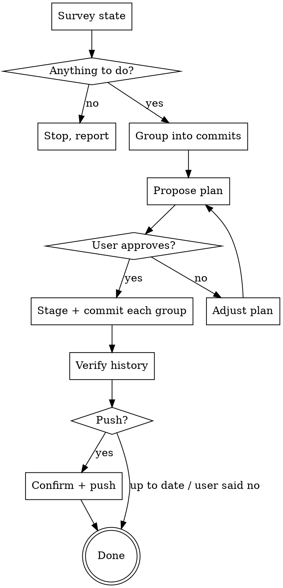

# Tidy Commit

Turn the current working tree into a clean, atomic, push-ready commit history that matches the user's actual changes.

## Core principle

**One logical change per commit.** A commit should capture a single coherent intent — a feature, a fix, a refactor, a docs update. Never bundle unrelated changes into one commit just because they happen to be uncommitted at the same time.

## When to use

- User wants to ship in-progress work and asked for clean commits + push
- User invoked `/tidy-commit`
- User says "commit and push" without specifying message — they want you to figure it out

## When NOT to use

- User gave an exact commit message → just commit, don't propose a plan
- User explicitly wants one big commit → respect that
- Working tree is clean and branch is in sync → say so and stop
- Mid-rebase, mid-merge, mid-cherry-pick, detached HEAD → stop and report state

## Workflow



### 1. Survey state (run in parallel)

```
git status                       # what's modified, staged, untracked
git diff                         # unstaged content
git diff --staged                # staged content
git log -10 --oneline            # recent commit message style
git rev-parse --abbrev-ref HEAD  # branch name
git status -sb                   # upstream tracking + ahead/behind
```

Stop and report if:
- `git status` shows `rebase in progress`, `MERGING`, `CHERRY-PICKING`, or detached HEAD → user must resolve first
- Working tree clean AND branch in sync with upstream → "Nothing to commit. Branch up to date." and stop
- Working tree clean AND branch ahead of upstream → skip to push step

### 2. Group changes by intent

Read the diffs. Group hunks/files by **what they accomplish together**, not by directory or file type. A useful test: could you describe each group in one short sentence ending in "because…"?

Heuristics for grouping:
- Same feature, fix, or refactor → one commit
- Test + the code it covers → same commit
- Generated/lockfile churn caused by a code change → same commit as the cause
- Unrelated typo fixes / formatting in unrelated files → separate commit ("chore:")
- Docs edits unrelated to code changes → separate commit
- Anything secret-looking (`.env`, keys, tokens) → DO NOT include; flag to user

If files contain a mix of unrelated changes (e.g., a fix and an unrelated refactor in the same file), use `git add -p` (or `git add --patch`) to stage hunks. Skip this complexity if files cleanly belong to one group each.

### 3. Match the repo's commit style

`git log -10 --oneline` shows the convention. Match it exactly:
- Conventional commits (`feat(scope): …`, `fix: …`, `chore: …`) → use that form
- Plain imperative ("Add X", "Fix Y") → use that form
- Short titles, body explains "why" if non-obvious

Each commit message:
- Title ≤ 72 chars, imperative mood
- Body (optional) explains WHY, not WHAT — the diff already shows what
- No marketing language, no "Successfully…", no "various improvements"
- Don't list files in the message — git shows that

### 4. Propose the plan

Show the user a numbered plan **before staging anything**:

```
Proposed commits:
1. feat(api): add rate limiting to /search
   - src/api/search.ts
   - src/middleware/rateLimit.ts
   - src/api/__tests__/search.test.ts

2. docs: document rate-limit config in README
   - README.md

3. chore: bump tsx to 4.7.2
   - package.json
   - package-lock.json

Push to origin/main after? (y / edit / no)
```

Wait for approval. If they want changes, adjust and re-show.

### 5. Stage and commit each group

For each group, in order:
- `git add <file1> <file2> …` — name files explicitly. **Never** use `git add .` or `git add -A` (sweeps in untracked junk and secrets).
- `git diff --staged` once to verify only the intended hunks are staged
- `git commit -m "$(cat <<'EOF' … EOF)"` for the message (heredoc preserves formatting)

Between commits, sanity-check `git status` to make sure remaining changes still match the next group.

### 6. Verify history

After all commits:
```
git log -<N> --stat   # N = number of commits created
```

Confirm each commit's title and file list match the plan.

### 7. Push (only if user said yes)

Before pushing:
- Re-confirm if the branch is `main` / `master` / `release/*` / a protected branch and the user hasn't explicitly said "yes push to main"
- If branch is behind upstream → stop and ask whether to rebase/merge first; do not auto-rebase
- If no upstream is set → `git push -u origin <branch>` (mention it)
- Otherwise → `git push`

After push: report the resulting `origin/<branch>` and the commit count pushed.

## Hard rules

- **Never** `git add .`, `git add -A`, or `git add *` — name files
- **Never** `git commit --amend` unless the user explicitly asked to amend
- **Never** `git push --force` / `--force-with-lease` unless explicitly asked
- **Never** `--no-verify`, `--no-gpg-sign`, or any hook-skipping flag
- **Never** `git reset --hard`, `git checkout -- .`, `git clean -fd` to "clean up" — investigate instead
- **Never** rewrite published commits (anything already on origin) without explicit instruction
- **Never** include `Co-Authored-By: Claude` or any AI attribution in messages unless the repo's existing log shows that style
- If a pre-commit hook fails: the commit did **not** happen. Fix the underlying issue, re-stage, create a **new** commit. Do NOT `--amend` (it would touch the previous commit).
- If you spot a likely secret in the diff (looks like an API key, `.env`, private key, credentials.json) → stop, name the file, ask before proceeding

## Common mistakes

| Mistake | Fix |
|---|---|
| Single "wip" commit bundling 5 unrelated things | Group by intent, propose multi-commit plan |
| Commit message describes the diff ("Update foo.ts") | Describe the WHY ("Cache search results to cut p95 latency") |
| Staged with `git add .` and got a stray `.DS_Store` | Always name files |
| Pushed to main without confirming | Confirm before pushing to protected branches |
| Used `--amend` after hook failure | Hook failure = commit didn't happen; create a NEW commit |
| Force-pushed because rebase felt easier | Never force-push without explicit ask |
| Wrote a 5-line summary at the end of the response | The diff is the summary; one line ("3 commits, pushed to origin/feat-x") is enough |

## Output to user

Keep status updates terse. Examples:

- "Surveying. 4 modified files, 1 untracked. Branch ahead of origin by 0."
- "Proposing 3 commits — see plan above."
- "3 commits created, pushing to origin/feat-rate-limit…"
- "Done. origin/feat-rate-limit now at 3a7f2c1."

No celebration, no emoji, no recap of the diff.
